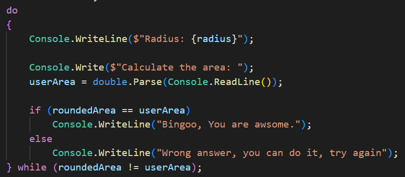
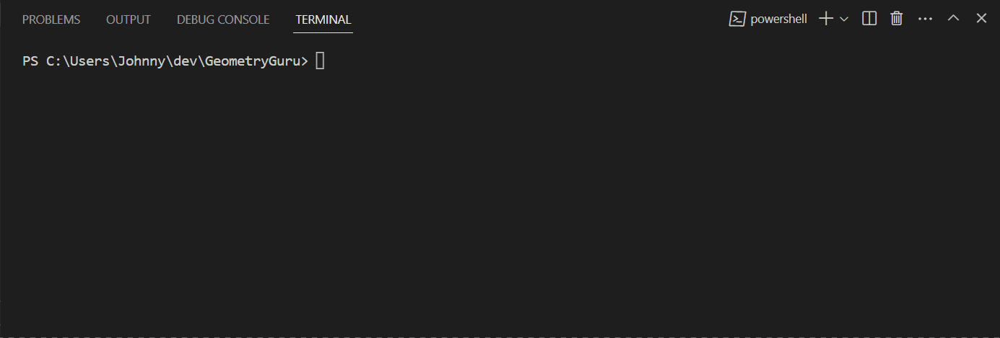

# GeometryGuru

This Application calculate the are of two shapes and check your knowladge in Geometry.

    1. Circle

   

    2. Triangle

I have used very basic operations and formula which is solve area of Circle:

* Console input/output 

    

* Arithmetic operations and `string` interpolation

    

* `switch` statement

    

* `do while` Loop

    

### Result:

If you want to run my code in your local computer, you can clone my code.

Click here for instruction **[video](https://www.loom.com/share/9cebefe04b8b40f0bb6c48f87f58ad59?sid=2f1e0720-d21d-4a89-8669-0673b6bf0053)**

## Release Notes

### V1.0

We are excited to announce the release of version 1.0 of our Geometry Guru App! This release introduces basic arithmetic calculations.

Features Added:

* You can calculate area of Circle.

### Path to Version 1.0

Click green word if you want to go **[Version 1.0](https://github.com/JohnnySenior/GeometryGuru/tree/releases/v1.0)**

### V2.0

We are excited to announce the release of version 2.0 of our Geometry Guru App! This release introduces basic arithmetic calculations.

Features Added:

* Bug fixes and other minor improvements.
* Add `switch` statement.
* You can choose shape.
    * Circle
    * Triangle

### Path to Version 2.0

Click green word if you want to go **[Version 2.0](https://github.com/JohnnySenior/GeometryGuru/tree/releases/v2.0)**

### V3.0

We are excited to announce the release of version 2.0 of our Geometry Guru App! This release introduces basic arithmetic calculations.

Features Added:

* Bug fixes and other minor improvements.
* Add `do while` statement.
* Add `goto` operator.
* Add checking sytem
    * If you enter wrong value app shows you error message.
* You can choose shape.
    * Circle
    * Triangle

### Note: You are in Version 3.0 now.
